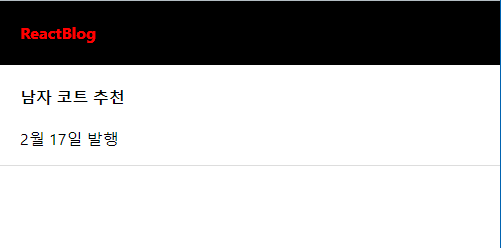

# ☑ import\&export 연습


### ✏️ 나 혼자 한 Ver.


```javascript

let data = [
  {
    id: 0,
    title: "White and Black",
    content: "Born in France",
    price: 120000,
  },

  {
    id: 1,
    title: "Red Knit",
    content: "Born in Seoul",
    price: 110000,
  },

  {
    id: 2,
    title: "Grey Yordan",
    content: "Born in the States",
    price: 130000,
  },
];
export default data;

```



```jsx

import "./App.css";
import Container from "react-bootstrap/Container";
import Nav from "react-bootstrap/Nav";
import Navbar from "react-bootstrap/Navbar";
import Row from 'react-bootstrap/Row';
import Col from 'react-bootstrap/Col';
// 이미지 넣는법
import mBg from './images/main_bg.png';

import { useState } from "react";

import data from "./data";


function App() {
  let [shoes] = useState(data);
  return (
    <div className="App">
      <Navbar bg="dark" data-bs-theme="dark">
        <Container>
          <Navbar.Brand href="#home">Navbar</Navbar.Brand>
          <Nav className="me-auto">
            <Nav.Link href="#home">Home</Nav.Link>
            <Nav.Link href="#features">Features</Nav.Link>
            <Nav.Link href="#pricing">Pricing</Nav.Link>
          </Nav>
        </Container>
      </Navbar>
      <div className="main_bg" style={{backgroundImage:'url('+ mBg +')'}}></div>
      <Container>
        <Row>
          <List shoes={shoes}></List>
        </Row>
    </Container>
    </div>
  );
}

function List(props){
  return(
    <div className="list">
      {
        props.shoes.map((a,i)=>{
          // console.log(0)
          return(
            <Col key={i}>
              
              <h4>{props.shoes[i].title}</h4>
              <p>{props.shoes[i].price}</p>
            </Col>
          )
        })
      }
    </div>
  )
}

export default App;
```



<div align="center">

<figure><figcaption></figcaption></figure>

</div>

### ✏️강의 정답 Ver.

