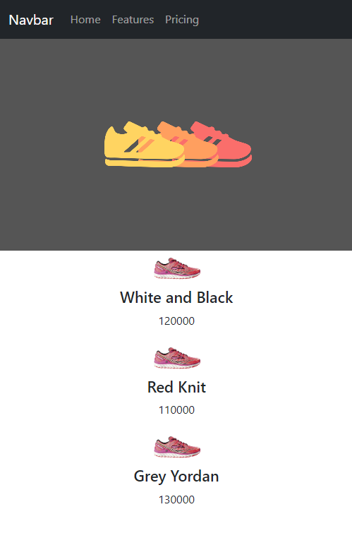

# 😀 useState : state 문법


먼저 카드형식의 레이아웃을 만들어본다.

<div align="left">

<figure><figcaption></figcaption></figure>

</div>

### 😊state 만드는 법


let posts ="어쩌구" 이렇게 변수에 데이터를 저장해서 데이터바인딩으로 뽑아 써도 되지만,

리액트에서는 변수 말고 state를 만들어서 데이터를 저장해둘 수 있다.


```jsx
import { useState } from 'react';
import './App.css'

function App(){
 
  let [a,b] = useState('남자 코트 추천');
  let posts = '강남 우동 맛집';
  return (
    <div className="App">
      <div className="black-nav">
        <div>개발 blog</div>
      </div>
      <div className="list">
        <h4>글제목</h4>
        <p>2월 17일 발행</p>
        <hr/>
      </div>
    </div>
  )
}
```

1. <mark style="background-color:yellow;">**import {useState} from 'react'**</mark> 작성을 한다
2. 원하는 곳에 <mark style="background-color:yellow;">**useState('보관할 자료')**</mark> 하면 state에 자료를 잠깐 저장할 수 있다.
3. <mark style="background-color:yellow;">**let \[a , b] = useState('남자 코트 추천');**</mark> 하면 저장한 자료를 나중에 쓸 수 있다.


### 😊 변수말고 state에 데이터를 저장하는 이유


```jsx
function App(){
  let [글제목, b] = useState('남자 코트 추천');

  return (
    <h4>{ 글제목 }</h4>
  )
}
```

state 에 있는 정보가 다른것으로 바뀌어도 <mark style="color:red;">**자동으로 재랜더링**</mark> 해주기 때문에&#x20;

따로 html을 건들 필요가 없다.&#x20;


그렇게 되면&#x20;

* UI 기능 개발이 편리해지고
* 사이트가 스무스 하게 동작하게 됩니다.


<mark style="background-color:yellow;">즉,  자주 변경될 것 같은 데이터들은 state에 저장해뒀다가 {데이터바인딩} 해놓고</mark>

변경할 일이 없는 데이터들은 변수에 저장해도 될것 같다.


### ✏️ 숙제


블로그 글 목록 3개를 html 레이아웃을 잘 짜서 만들어오시고

제목부분에 들어갈 3개의 데이터는 state에 저장해본 후에 html에 집어넣어보십시오 (데이터바인딩하세요)


```jsx

import { useState } from "react";
import "./App.css";

function App() {

  let post = '강남 우동 맛집';
  let [글제목 ,b] = useState(['남자 코트 추천', '강남 우동 맛집', '파이썬 독학']);
  let [logo , setLogo] = useState('ReactBlog');
  // console.log(글제목)


  return <div className="App">
    <div className="black-nav">
      <h4 style = {{color:'red',fontSize:'16px'}}>{logo}</h4>
    </div>
    <div className="list">
      <h4>{글제목[0]}</h4>
      <p>2월 17일 발행</p>
    </div>
    <div className="list">
      <h4>{글제목[1]}</h4>
      <p>2월 17일 발행</p>
    </div>
    <div className="list">
      <h4>{글제목[2]}</h4>
      <p>2월 17일 발행</p>
    </div>
  </div>

}

export default App;

```

state 자료에 array를 사용해서 자료 3개를 저장해 놓고

데이터 바인딩 할때 array자료형을 순서대로 뽑아서 표시해 주었다 !!


<div align="left">

<figure><figcaption></figcaption></figure>

</div>
